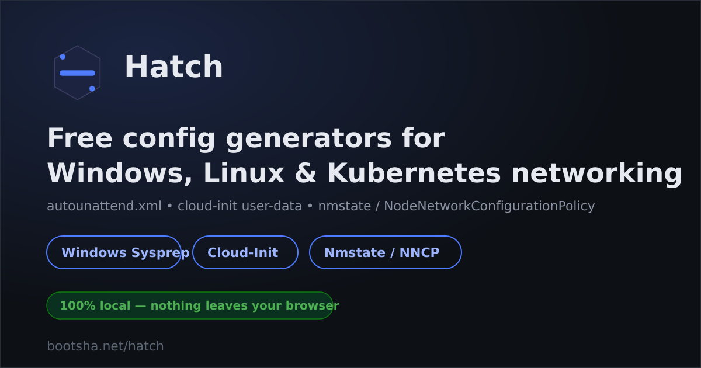

# Hatch

Free, browser-based config generators for automated OS deployment and network configuration. No build step, no backend, no account — open a page, fill in a form, download or copy the result.

**Live: [bootsha.net/hatch](https://bootsha.net/hatch/)**



## Tools

### 🪟 [Windows Sysprep Generator](https://bootsha.net/hatch/sysprep.html)
Generates `autounattend.xml` for fully automated, unattended Windows installation.
- Windows 10 / 11, Server 2016–2025
- UEFI & BIOS, disk partitioning
- Local accounts, domain join, OOBE, privacy/telemetry settings
- First-run and specialize commands, WDS

### ☁️ [Cloud-Init Config Generator](https://bootsha.net/hatch/cloudinit.html)
Generates `user-data` and `network-config` for cloud-init.
- Ubuntu / Debian, RHEL / Rocky, Amazon Linux, SUSE
- Users, SSH keys, packages, APT/YUM repos
- Storage mounts (including NFS/CIFS with automatic `_netdev`) and swap
- Write files, boot/run commands, guided or raw systemd unit creation
- NoCloud / AWS / Azure output, plus an OpenShift Virtualization console YAML mode

### 🔌 [Nmstate Network Config Generator](https://bootsha.net/hatch/nmstate.html)
Generates declarative [nmstate](https://nmstate.io/) state YAML and OpenShift `NodeNetworkConfigurationPolicy` (NNCP) CRs.
- Ethernet, bond, VLAN, Linux bridge, and OVS bridge interfaces
- SR-IOV virtual functions per NIC (MAC, VLAN, spoof-check, trust, min/max TX rate)
- All standard bonding modes, static routes, route rules, DNS resolver
- Generates raw `nmstate` YAML and a `NodeNetworkConfigurationPolicy` CR side by side from the same input

## Why

- **Nothing leaves your browser.** All generation happens client-side in plain JavaScript — no server, no telemetry, no accounts.
- **No build step.** Each tool is a single self-contained HTML file. Clone the repo and open it directly, or serve it with any static file server.
- **No dependencies.** No framework, no bundler, no npm install.

## Running locally

```bash
git clone https://github.com/linusali/hatch.git
cd hatch
python3 -m http.server 8000
# open http://localhost:8000/
```

Or just open `index.html` directly in a browser.

## Project structure

```
index.html      landing page
sysprep.html    Windows sysprep / autounattend.xml generator
cloudinit.html  cloud-init user-data / network-config generator
nmstate.html    nmstate state YAML / NodeNetworkConfigurationPolicy generator
```

Each tool page is fully self-contained (HTML + CSS + JS in one file) — there is no shared build artifact or component library to keep in sync.

## Contributing

Issues and pull requests are welcome. Since each tool is a single file, most changes are localized — no build pipeline to fight.
